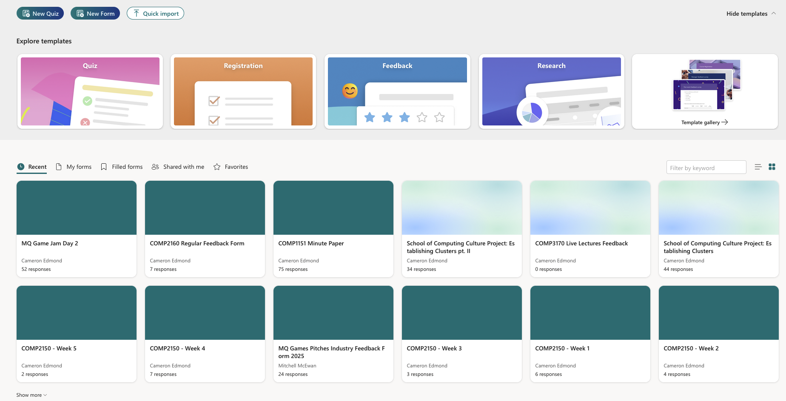
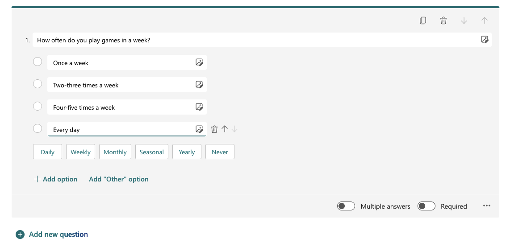
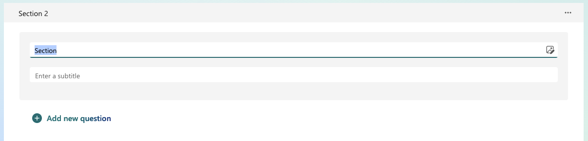
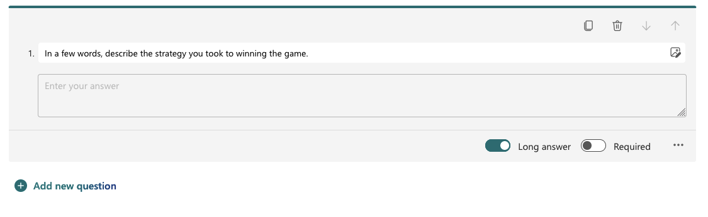
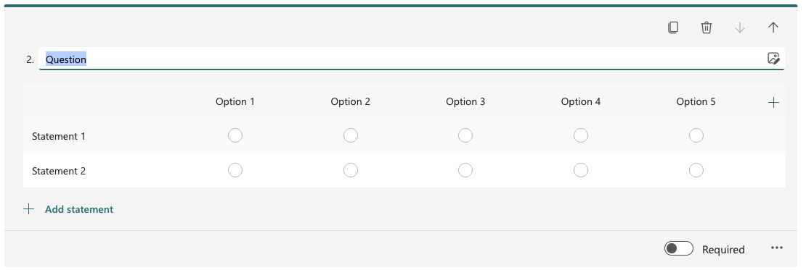
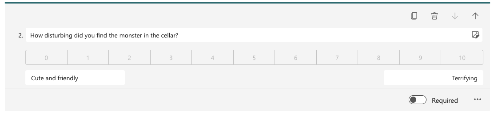
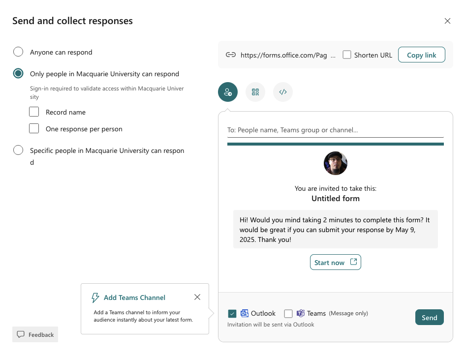
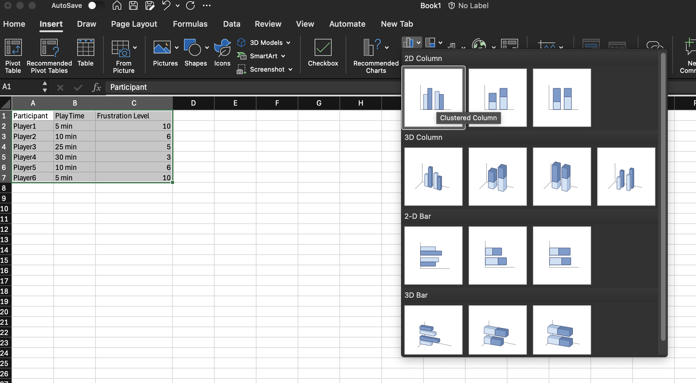
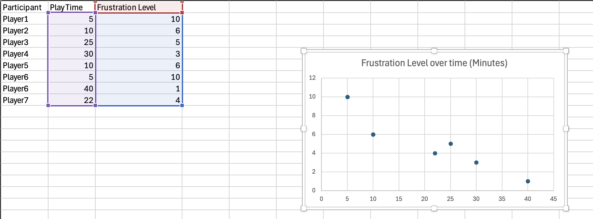
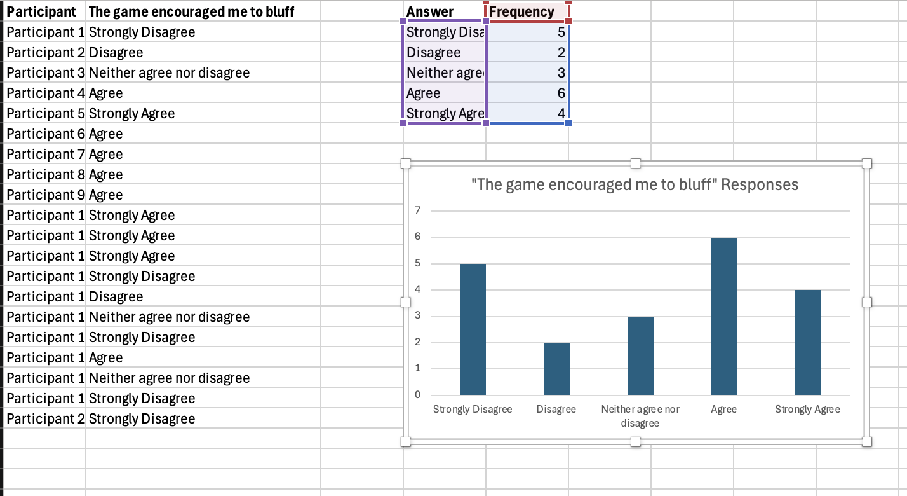

# Week 09 - Playtesting Tools
In today's prac, we will be introducing you to some of the tools and standards to use when conducting playtests. This prac will equip you with the necessary tools for creating and conducting playtests.

Please note: although you are doing a "full run through" of creating questions, collecting data and analysing it, we will NOT be talking best practice here. This is about the workflow and tools used in this type of endeavour, so that you aren't running into problems around using them for the first time during your assignment, and so you know what is possible. The theory behind playtesting and best practice approaches are covered in the lecture and SGTA for this week.

## Tools used
Today's task uses (but is not limited to):

* playingcards.io
* Microsoft Forms
* Microsoft Excel

## Assignment deliverable
You will not be creating any assignment deliverables today. However, you will be getting familiar with the tools needed to create playtesting instruments and visualising the results. These skills will be very helpful for the final assignment.

## Tabletop Game Task Released
The final assignment, Tabletop Game Design and Game Playtesting, has been released on iLearn. If you haven't already, now is a good time to give it a quick look. 

Have a read over the assignment and ask yourself:

* Is what I'm expected to make clear to me?
* Do I understand what each individual component of the assignment is? (Write down each thing that must be done and submitted).
* Do I understand what the rubric is asking of me? What kind of mark do I think I should aim for in this assignment? (Hint: it's okay to not aim for HD. We understand if this unit isn't your whole life! You should be honest with yourself so you can team up with people with similar goals).

Any questions you might have that come from asking yourself these questions, jot them down to email to the lecturers or see us in the lecture next week! We're more than happy to spend the time answering questions!

## Designing a Playtest
Today, we will be creating a sort of "trial playtest" from one of the games on playingcards.io. You'll be exploring the theory around what makes a good playtest in the SGTA, but here we are just going to focus on implementation.

Firstly, head to playingcards.io and select a game. Let's go with _31_, because it is a two-player game and therefore you can get as much respondent data as possible.

Have a bit of a play around with _31_ and ensure you understand how the game works. Then, think about the kind of questions you'll need to ask to answer the following design questions:

* What kind of strategies do players employ, if any, when playing the game?
* Are the rules of the game easy to understand and follow?
* How well does the game engage with the experience goal if __Fellowship__?

Have a think about the kinds of questions you would ask players in a post-game survey to answer these questions. Keep in mind that you can get meaningful data via observation and other methods, but for now we are focused on surveys. You also want to consider a small set of important demographic/psychographic data you want to collect.

Write down a plan, coming up with two-three survey questions for each of the above design questions. It would behove you to combine methods to get the most out of these tasks, so ensure you have at least one of each of the following:

* A Likert scale
* A multiple-choice question
* An open-ended question

As the lecture discussed, each of these are useful for gathering different types of data. We want to understand how to use these Microsoft Forms to get this data, and methods for analysing this data, to make our lives easier when we do the final assignment.
 
## Creating a Microsoft Form
Once you have your survey questions, head to forms.office.com and press the "New Form" button (You'll probably need to log-in). 

You'll be presented with an empty form with a space to input a name, and a bunch of options to choose from. Type a name for your form. Remember to name your form something meaningful, like "COMP2150 Practice Form".

Then, select one of the options to add that content-type to your form. As stated, try to have a variety of different ones. Below, we will outline a few of them and how to set them up properly. Although we will give some recommendations below, refer to the lecture for more of an understanding around the theory and how to craft a good question. Much like last week, this is about exploration so that you are aware how things work for doing your assignment.

### Choice

Choices allow you to create multiple-choice questions. They can be useful for questions where you want a small set of predictable answers, especially collecting demographic/psychographic data. For instance, if you want to know how often someone plays games in a week, you don't want an open-ended text box, because answers will all be written very differently. A multiple-choice question will allow you to write something like "Once a week", "Two-three times a week", "Daily". This will give you much more easily interpretable data.

You can also allow participants to select multiple responses by click the "Multiple answers" button. This is useful if you are trying to collect information where one answer doesn't exclude another. An example would be a question like "Which of the following games have you heard of?"

Try creating two Choice questions now, one that accepts multiple answers and one that doesn't. Press the "+ Add option" button to add additional options, and press "Add new question" to add another question.

### Section

Sections are a good way to break-up your content on different pages, such as when you are evaluating different things about your game (for instance, demographic/psychographic data being in a section, then the actual playtesting questions in another). A section has a name and a subtitle. Use these meaningfully.

Note: when you add a section, anything above it is automatically placed into "Section 1", which you can also edit.

### Text

Text questions allow you to collect the free-writing of your participants in either a short or long form (Turning on the "Long answer" button allows them to write more). Although this is a powerful way to collect lots of data, you need to be very careful as the data collected in this way is not easily visualised, and people will often write things you aren't expecting. It is a whole new ball game when it comes to analysing such data!

Still, this can be very useful for capturing more subjective experiences, such as asking players to describe what they thought the rules were, discrepancies they had, or to give more general feedback on the game.

Go ahead and create a text question that encourages an open-ended but meaningful response.

### Likert

Likert scales are commonly used for "Agree/Disagree" questions, where you present the participant with a statement and then have five or so options ranging from "Strongly Disagree" to "Strongly Agree". They can be used in different ways however, but are very useful for testing sentiment around a particular statement, e.g. "The game encouraged me to bluff", or "I felt tense when it was my turn".

Keep in mind that each Likert "question" can have many statements, but the options much be the same for all of them. This makes it very easy to visualise and analyse the data, but means you need to add a new question if you need these options to be different. Be careful of overwhelming your participants!

### Net Prompter Score

A net prompter score is a lot like a Likert scale in that it asks participants to rate something along a scale. However, instead of presenting a named tag for each option, it presents the two extremes and options from 0-10 in between. This can be another useful tool when trying to understand a participant's views on something where there are two opposing positions (likely one you want to achieve, and one you want to avoid). An example would be when evaluating the monster design in a horror game, having a question such as "How disturbing did you find the monster in the cellar?" and with tags from "Cute and friendly" to "Terrifying".

### Other tools
There are a few other tools within Microsoft Forms, but we don't want to overwhelm you here. Feel free to experiment in your free time with this, but we strongly believe you can complete the assignment with Multiple Choice, Likert, Net Prompter, Text questions, and Sections.

## Collecting Data
Once you have created your survey (with a mix of instruments, and answering the design questions from before), get someone over to play _31_ with you and then fill out your survey. Do the same for them. You want to repeat this process a few times to ensure you have a good amount of data. Exactly how much will depend on how many students are in the class but try to get around to getting data from a good chunk of your peers (and do their surveys too!). To get them to complete your survey, click "Collect Responses" on your survey and copy the link. Be mindful of the permissions data on the right -- you will probably want to set this to "Anyone can respond" when collecting data for your game so you can spread the playtesting far and wide.

## Importing, visualising and reading data in Excel

### Getting data into Excel
Once you've got enough data, return to your form and press the "View responses" button. You'll be presented with a screen that will give you an okay break down of the data, but nothing super useful. Instead, we want to get this data into Excel so we can create our own visualisations, analyse it, and share it with our team (and our markers!). Press the small arrow next to "Open results in Excel" and then click "Download a Copy". Open this data in Excel.

### Creating visualisations
Once you have your data, you can select it in Excel, then head to the Insert tab and select from the Chart Options. 

Have a play around with this - it is tempting to go to bar charts for everything, and they can be useful! However, other types of charts can be handy too. For instance, if we want to compare the two values, we have for each of our participants, a scatterplot can give us a nice vision of this. Below is a scatterplot comparing a player's frustration level based on how long they've played the game for, showing that frustration appears to drop the more someone plays the game:

In some cases, you'll need to add some calculations to get your data in a form you can easily visualise. For instance, if you've got a big list of responses to your net prompter, you'll need to count your responses into categories before you can visualise them. Something like this:

The data on the far left is the raw data. Next to it, we've counted each instance of each statement using the [`COUNTIF(range,criteria)`](https://support.microsoft.com/en-au/office/countif-function-e0de10c6-f885-4e71-abb4-1f464816df34) formula, then visualised that output below. This is often a handy way to wrangle your data before visualising. Always use formulas though, don't copy and paste data (human error can result in fabricated data!).

Spend some time exploring the visualisation of your data. You can edit the title of a chart by clicking on its title, modifying the chart by selecting Chart Design and then Add Chart Element, clicking one of the Styles, or exploring one of the other options.

### Reading the data
Once you've got one or two visualisations, read the data. What are some interesting conclusions you can find? Data analysis is iterative - don't be afraid to create more charts, re-create them, etc. to follow any interesting results. You might find one correlation that deserves further enquiry, or that you need to look at your data in a different way to get useful results. Write down your observations from your data, taking note of where data might be incomplete, or where conclusions can't be drawn for one reason or another (naturally we'd want a lot more data than this, but you want to be thinking about things like lack of clarity of a question, or factors that may have skewed results).

Once you are done, share your observations with another student. Discuss your results together and how you came to those conclusions.

## Reflect
Reflect on this exercise and the data collected, consider:

* Did the questions you choose to ask your participants provide meaningful answers to your design questions? Why/why not?
* Did you choose the right instruments for these questions (e.g., did you use a Likert appropriately)? Why/why not?
* Was your data easy to visualise and analyse? What visualisation methods worked best?

## Next Week
Next week, you will begin considering the world building and metaphor of your final game.